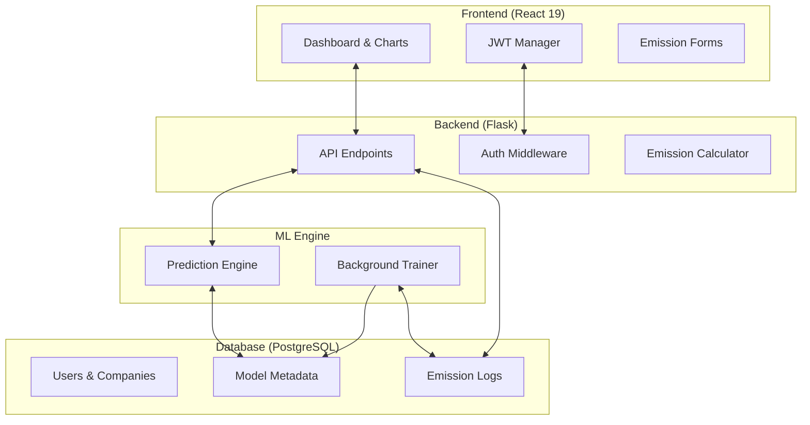

<div align="center">
    
# 🌱 GreenCO2
    
### *Empowering Sustainable Enterprises with Data-Driven Carbon Intelligence*

[](https://react.dev/)
[](https://flask.palletsprojects.com/)
[](https://www.postgresql.org/)
[](https://scikit-learn.org/)
[](https://opensource.org/licenses/MIT)

---

[Overview](#-overview) • [Key Features](#-key-features) • [Tech Stack](#-tech-stack) • [Architecture](#-architecture) • [Getting Started](#-getting-started) • [ML Engine](#-ml-engine)

</div>

## 📖 Overview

**GreenCO2** is an end-to-end SaaS platform designed for modern enterprises to monitor, analyze, and predict their carbon footprint. By integrating real-time emission tracking with advanced machine learning forecasting, GreenCO2 transforms raw consumption data into actionable environmental insights.

Our mission is to bridge the gap between industrial operations and sustainability goals through a seamless, automated, and visually intuitive data pipeline.

---

## ✨ Key Features

- 📊 **Dynamic Dashboard**: Real-time visualization of daily and monthly emission trends using high-performance charts.
- 🧪 **Multi-Source Tracking**: Log consumption across Diesel, Petrol, Natural Gas, and Electricity with server-side verified emission factors.
- 🔮 **AI Forecasting**: Predictive analytics that forecast the next 7 days of emissions based on historical patterns per company.
- 🛡️ **Enterprise Security**: Secure JWT-based authentication with company-isolated data structures.
- ⚙️ **Automated ML Lifecycle**: Daily background retraining of models to ensure forecasting accuracy as consumption patterns evolve.
- 📱 **Responsive Design**: A premium, dark-mode "Glassmorphism" interface built for high-end user experience.

---

## 🛠️ Tech Stack

### Frontend
- **Framework**: [React 19](https://react.dev/)
- **Charts**: [Recharts](https://recharts.org/)
- **API Client**: Axios
- **Styling**: Modern CSS with Glassmorphism & Responsive Layouts

### Backend
- **Framework**: [Flask](https://flask.palletsprojects.com/)
- **Authentication**: Flask-JWT-Extended
- **Database**: [PostgreSQL](https://www.postgresql.org/)
- **Scheduling**: APScheduler (Daily Model Retraining)

### Machine Learning
- **Engine**: Scikit-learn / Pandas
- **Models**: Linear Regression & Time-Series Forecasting
- **Workflow**: Per-company model isolation and automated retraining.

---

## 🏗️ Architecture



---

## 🚀 Getting Started

### Prerequisites
- Python 3.9+
- Node.js 18+
- PostgreSQL instance

### 1. Backend Setup
```bash
cd backend
python -m venv venv
source venv/bin/scripts/activate  # Windows: .\venv\Scripts\activate
pip install -r requirements.txt   # Ensure requirements.txt exists
```
Create a `.env` file in the `backend/` directory:
```env
DB_NAME=greenco2
DB_USER=your_user
DB_PASSWORD=your_password
DB_HOST=localhost
DB_PORT=5432
JWT_SECRET_KEY=your_secure_key
```
Initialize the database:
```bash
python apply_schema.py
```
Run the server:
```bash
python app.py
```

### 2. Frontend Setup
```bash
cd frontend
npm install
npm start
```

---

## 🧠 ML Engine & Forecasting

The GreenCO2 prediction engine utilizes a custom time-series approach:
1. **Data Aggregation**: Collects daily emission totals per company.
2. **Model Training**: A dedicated model is trained for each company to capture specific industrial cycles.
3. **Forecasting**: Generates a 7-day outlook to help managers anticipate sustainability targets.
4. **Maintenance**: Models are automatically retrained every 24 hours via `APScheduler` to adapt to recent trends.

---


<div align="center">
Built with ❤️ for a Greener Future.
</div>

